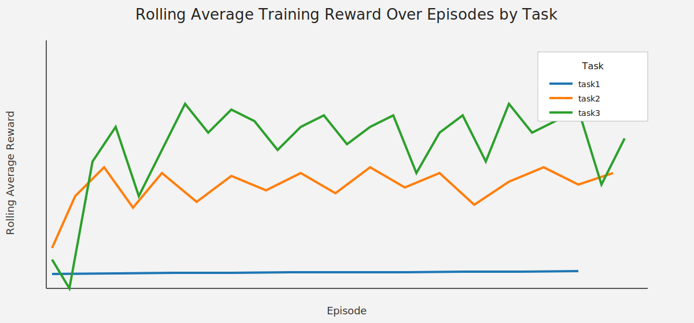
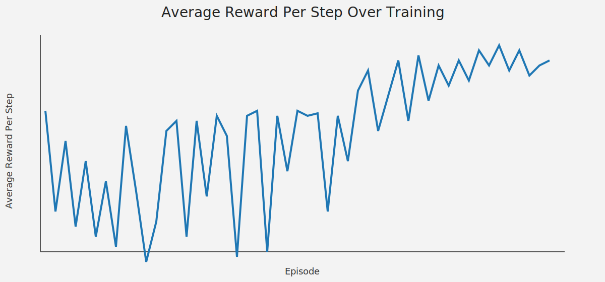
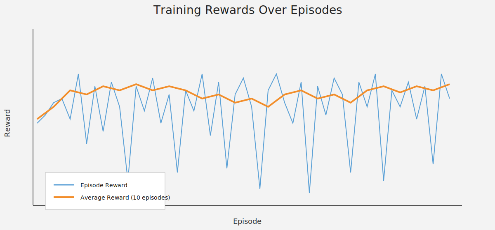

# FeatureFlag Agent Environment

AI-powered simulation for safe feature rollout decisions under uncertainty.

This project models a real progressive delivery problem: how to increase rollout quickly enough to capture adoption and revenue, while avoiding incidents (error spikes, latency regressions, low health states) that can force rollback.

## Live Environment (Hugging Face Space)

- Live API base URL: https://featureflag-featureflag.hf.space
- Interactive API docs: https://featureflag-featureflag.hf.space/docs

The repository supports direct deployment to your own Hugging Face Docker Space as well. See the deployment section below.

## Why This Problem Matters

In production systems, feature rollout is not just a binary on/off operation. Teams balance competing objectives:

- Product wants faster adoption.
- Engineering wants stable error and latency budgets.
- Business wants revenue lift without outages.

This environment turns that tradeoff into a sequential decision-making benchmark with measurable outcomes.

## What The Environment Simulates

Each episode represents one rollout lifecycle. The agent chooses rollout actions step-by-step, and the simulator returns updated system telemetry.

### Action Space

| Action             | Description                    |
| ------------------ | ------------------------------ |
| `INCREASE_ROLLOUT` | Increase deployment percentage |
| `DECREASE_ROLLOUT` | Decrease deployment percentage |
| `MAINTAIN`         | Keep current percentage        |
| `HALT_ROLLOUT`     | Pause rollout temporarily      |
| `FULL_ROLLOUT`     | Deploy to 100% immediately     |
| `ROLLBACK`         | Emergency revert to 0%         |

### Observation Space (Core Signals)

| Field                        | Type  | Description                    |
| ---------------------------- | ----- | ------------------------------ |
| `current_rollout_percentage` | float | Current rollout percentage     |
| `error_rate`                 | float | Error rate in [0.0, 1.0]       |
| `latency_p99_ms`             | float | P99 latency (ms)               |
| `user_adoption_rate`         | float | Adoption in [0.0, 1.0]         |
| `revenue_impact`             | float | Revenue impact ($)             |
| `system_health_score`        | float | Composite health in [0.0, 1.0] |
| `active_users`               | int   | Active users                   |
| `time_step`                  | int   | Current step in episode        |

## Task Setup And Scoring

The OpenEnv spec defines 3 tasks with dedicated graders:

- `task1_safe_rollout` (easy): reach ~25% rollout safely.
- `task2_risk_aware` (medium): scale toward ~75% while reacting to incidents.
- `task3_multi_objective` (hard): balance adoption, revenue, health, and risk over longer horizons.

Scores are normalized to `0.0 - 1.0` using task-specific criteria in the grader logic.

## End-to-End Project Flow

1. Agent receives observation.
2. Agent selects one rollout action.
3. Environment updates simulated telemetry (error, latency, adoption, health, revenue).
4. Reward function evaluates the transition.
5. Task grader scores full trajectory at episode end.
6. Inference prints `[START]`, `[STEP]`, and `[END]` logs for reproducible evaluation.

Implementation-wise:

- Core env logic lives in [feature-flag-agent-env/feature_flag_env/server/feature_flag_environment.py](feature-flag-agent-env/feature_flag_env/server/feature_flag_environment.py).
- API server lives in [feature-flag-agent-env/feature_flag_env/server/app.py](feature-flag-agent-env/feature_flag_env/server/app.py).
- Root-level wrappers ([server/app.py](server/app.py) and [inference.py](inference.py)) keep OpenEnv/HF validation compatibility from repository root.

## Agents Included

- Baseline agent: deterministic safety heuristic.
- LLM agent: OpenAI-compatible action reasoning with fallback.
- Hybrid agent: LLM proposal + safety override.
- RL/Enterprise agent: checkpoint-based policy for stronger autonomous control.
- Ensemble agent: multi-policy voting strategies.
- Human-in-the-loop agent: confidence-aware approval/fallback flow.

## Verified Results Snapshot

From the latest project test and validation artifacts:

- Full suite: `113 passed`
- Monitoring tests: `33 passed`
- Security tests: `23 passed`
- Server tests: `6 passed`
- Unified check script (`run_all_checks.ps1`): `Passed: 12, Failed: 0, Overall: PASS`

Additional benchmark/training notes documented in project guides show:

- Task1 baseline scores commonly in the high range (~`0.88 - 0.96` in the setup guide examples).
- Task2 tuning improvements recorded from approximately `0.630` to `0.677+` in implementation notes.

## Training Visuals And Colab Scripts

### Training Script 1 (Colab)

Link: https://colab.research.google.com/drive/1dYUdTktO6KRvs-ab388IA1ubSwBrRuqx?usp=sharing



### Training Script 2 (Colab)

Link: https://colab.research.google.com/drive/1MPT7fOVPePx-LNp9xf00p12c24CqzsTi?usp=sharing



### Training Script 3 (Colab)

Link: https://colab.research.google.com/drive/1zAguFmDJBuZcSIBeOzhsO8GWAlpcs42R?usp=sharing



## Quick Start (Repository Root)

```bash
# 1) Install backend package and dependencies
pip install -e .

# 2) Run baseline inference locally
python inference.py --agent baseline --episodes 3 --task task1

# 3) Start API server (OpenEnv/HF default port)
python -m server.app
```

Server health check:

```bash
curl http://127.0.0.1:7860/health
```

## Run Against Remote Space

```bash
python inference.py --remote --server-url https://featureflag-featureflag.hf.space --agent baseline --episodes 1 --task task1
```

## Hugging Face Router Mode For LLM Agent

```bash
LLM_PROVIDER=hf
HF_API_BASE_URL=https://router.huggingface.co/v1
MODEL_NAME=Qwen/Qwen2.5-7B-Instruct
HF_TOKEN=hf_xxx

python inference.py --agent llm --episodes 1 --task task1
```

## Deploy To Hugging Face Spaces (Docker)

Full guide:

- [DEPLOY_TO_HUGGINGFACE.md](DEPLOY_TO_HUGGINGFACE.md)

PowerShell quick deploy from repo root:

```powershell
./scripts/deploy_to_hf.ps1 -SpaceId "your-username/feature-flag-ai"
```

This uses the repository Dockerfile and keeps the app on port `7860`, aligned with Hugging Face Space expectations.

## API Endpoints

Core endpoints:

- `GET /health`
- `POST /reset`
- `POST /step`
- `GET /state`
- `GET /info`

Optional endpoints (if corresponding modules are enabled):

- Security: `/security/status`, `/security/token`, `/security/audit/actions`, `/security/quota`
- Monitoring: `/metrics`, `/monitoring/health`, `/monitoring/dashboard`, `/monitoring/alerts`

## References And Additional Materials

Core setup and deployment:

- [README.md](README.md) (this file)
- [DEPLOY_TO_HUGGINGFACE.md](DEPLOY_TO_HUGGINGFACE.md)
- [COMPLETE_SETUP_AND_REFERENCE_GUIDE.md](COMPLETE_SETUP_AND_REFERENCE_GUIDE.md)
- [openenv.yaml](openenv.yaml)

Implementation and validation artifacts:

- [feature-flag-agent-env/FEATURE_CHANGES_AND_TESTING.md](feature-flag-agent-env/FEATURE_CHANGES_AND_TESTING.md)
- [feature-flag-agent-env/IMPLEMENTATION_SUMMARY.md](feature-flag-agent-env/IMPLEMENTATION_SUMMARY.md)
- [feature-flag-agent-env/TEST_RESULTS.md](feature-flag-agent-env/TEST_RESULTS.md)
- [feature-flag-agent-env/COMMANDS_TO_TEST.md](feature-flag-agent-env/COMMANDS_TO_TEST.md)
- [feature-flag-agent-env/QUICK_REFERENCE.md](feature-flag-agent-env/QUICK_REFERENCE.md)
- [feature-flag-agent-env/final_verification.py](feature-flag-agent-env/final_verification.py)

Security and enterprise extensions:

- [feature-flag-agent-env/SECURITY_GUIDE.md](feature-flag-agent-env/SECURITY_GUIDE.md)
- [feature-flag-agent-env/verify_security.py](feature-flag-agent-env/verify_security.py)

Front-end references (if using UI workflows):

- [frontend/README.md](frontend/README.md)

If you publish external materials (demo video, blog post, slides, presentation), add them under this section so evaluators and third-party readers have one canonical entry point.
